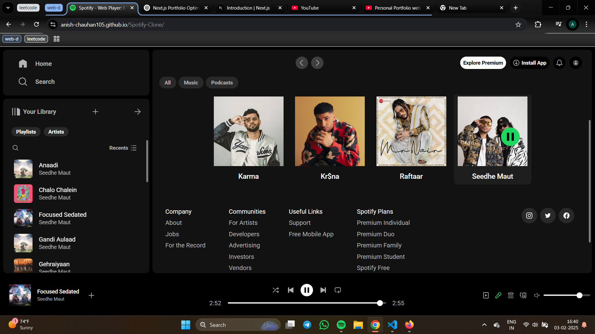

# 🚀 My Portfolio Website

Welcome to my **Next.js Portfolio Website**! This is a modern and responsive personal portfolio built with the latest **Next.js App Router, Tailwind CSS, and MongoDB**. It showcases my projects, skills, and allows users to interact via authentication and payments.

## 🔗 Live Demo

[View the Live Website](https://portfolio-1cmwk1d1t-anish-chauhan105s-projects.vercel.app/)

## 📸 Screenshots

| Home Page | Projects Page |
| --------- | ------------- |
|  |  |

## 🛠️ Features

- 🌟 **Fully Responsive** – Works on all devices
- ⚡ **Fast & Optimized** – Using Next.js App Router
- 🎨 **Styled with Tailwind CSS**
- 🔐 **User Authentication** – Integrated with Clerk.js
- 💳 **Razorpay Payments** – Accept donations & payments
- 📊 **Visitor Counter** – Stored in MongoDB
- 📂 **Projects Showcase** – Display my best work
- ✉️ **Contact Form** – Users can reach out easily

## 🏗️ Tech Stack

- **Frontend:** Next.js (App Router), Tailwind CSS
- **Backend:** Next.js API Routes, MongoDB
- **Authentication:** Clerk.js
- **Payments:** Razorpay

## 📂 Project Structure

```
📁 my-portfolio
 ┣ 📂 app  
 ┃ ┣ 📜 globals.css, layout.js, page.js  
 ┃ ┣ 📂 api (contact, payment, razorpay, visitor)  
 ┃ ┣ 📂 components  
 ┃ ┣ 📂 pages (about, contact, dashboard, payment, shop, socials, etc.)  
 ┃ ┣ 📂 auth (sign-in, sign-up)  
 ┣ 📂 lib  
 ┣ 📂 models  
 ┣ 📂 public  
 ┣ 📂 styles  
 ┣ 📄 tailwind.config.mjs, postcss.config.mjs, next.config.mjs  
 ┣ 📄 package.json  
 ┗ 📄 README.md  

```

## 🚀 Getting Started

### 1️⃣ Prerequisites

Ensure you have the following installed:
- **Node.js (Latest LTS Version)**
- **npm** or **yarn**

### 2️⃣ Clone the Repository

```sh
git clone https://github.com/ANISH-CHAUHAN105/Portfolio.git
cd Portfolio
```

### 3️⃣ Install Dependencies

```sh
npm install
```

### 4️⃣ Set Up Environment Variables

Create a `.env.local` file and add the required environment variables:

```sh
NEXT_PUBLIC_CLERK_PUBLISHABLE_KEY=your_clerk_key
CLERK_SECRET_KEY=your_clerk_secret
MONGODB_URI=your_mongo_uri
RAZORPAY_KEY_ID=your_razorpay_key
RAZORPAY_KEY_SECRET=your_razorpay_secret
```

### 5️⃣ Run the Project

```sh
npm run dev
```

The project will be running at [**https://portfolio-1cmwk1d1t-anish-chauhan105s-projects.vercel.app/**](https://portfolio-1cmwk1d1t-anish-chauhan105s-projects.vercel.app/).

## 🚀 Deployment Guide

You can deploy this project easily on **Vercel**:
1. Install the Vercel CLI: `npm install -g vercel`
2. Run `vercel` in the project directory and follow the setup steps.
3. Your project will be live!

## 🛠️ How to Contribute

1. **Fork** the repository.
2. **Create** a new branch: `git checkout -b feature-branch`.
3. **Commit** your changes: `git commit -m "Add feature"`.
4. **Push** to the branch: `git push origin feature-branch`.
5. **Create a Pull Request** on GitHub.

## 📜 License

This project is licensed under the **MIT License**.

## 📞 Contact

- **Portfolio**: [https://portfolio-1cmwk1d1t-anish-chauhan105s-projects.vercel.app/](https://portfolio-1cmwk1d1t-anish-chauhan105s-projects.vercel.app/)
- **GitHub**: [@ANISH-CHAUHAN105](https://github.com/ANISH-CHAUHAN105)
- **LinkedIn**: [anish-chauhan-438735296](https://www.linkedin.com/in/anish-chauhan-438735296/) 
- **Email**: [canish005@gmail.com](mailto:canish005@gmail.com) 

